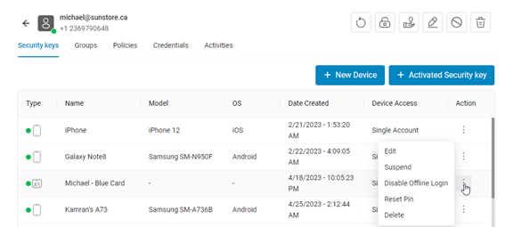

### Manage Security Keys

By clicking on each of the added users, you will be directed to a page that has 5 sections including:
**Security keys**, **Groups**, **Policies**, **Credentials** and **Activities**.

#### 1. Security keys:

In this section, devices that have been added to the user or the devices that are added by clicking
the New Device button are shown. These devices are displayed with the status of new user, pending, active or
suspended. And from the action section, it is possible to perform activities such as Edit, Delete, Suspend,
Enable/Disable Offline Login and Reset Pin.

##### Action list items:

* **Edit:** Ability to edit device name and enable/disable Bluetooth Proximity.
* **Suspend:** Disables the device.
* **Offline Login:** It is possible to enable or disable offline login for remote users.
* **Reset Pin:** Resetting contactless card PIN.
* **Delete:** Deletes the device.

#### 2. Groups:

Lists the groups the user belongs to. Except for the Everyone group, administrator can remove the user from other
groups, and can also add the user to a new group.

#### 3. Policies:

Lists user policies. There is a Manage button that takes the admin to the security key policy section to
edit user policies.

#### 4. Credentials:

It displays the accounts added for the user.

#### 5. Activities:

It displays the register and login activities of the user.

---

There are some icons at the top of the table, such as Refresh, Edit, Get Temporary Access Pass, Activate User Provision,
Delete, Suspend or Activate Security Key.

* Refresh: It is to refresh the information of this section.
* Edit: It is possible to edit basic information.
* Temporary Access Pass: A time-limited passcode to activate the smartphone.
* User Provision:  It is possible to register the user by admin. (For complete information about User Provisioning refer
  to [this link](https://docs.idmelon.com/docs/administration/userprovisioning/)).
* Delete:  To delete the user.
* Suspend or Activate security key: It is for activating or deactivating the user.

Under the icons, there are 2 buttons:

1.	Add Device: Allows adding new devices.
2.	Activated Security key: For complete information about Shared Accounts refer to [this link](https://docs.idmelon.com/docs/administration/sharedaccounts/).
