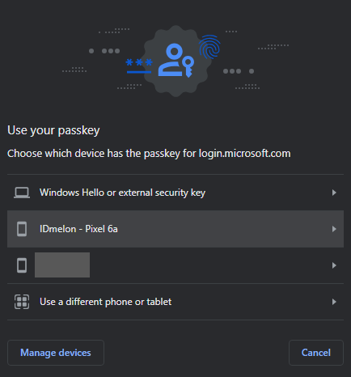

### Hybrid Transport

When it comes to performing FIDO (Fast Identity Online) authentication on a desktop browser, the IDmelon Android app
offers a convenient solution. This feature allows for passwordless authentication, eliminating the need for additional
software installation on the PC/Laptop. By initially pairing your mobile device and browser, subsequent uses only
require a single click for registration or login, making the process seamless and efficient. This powerful feature,
known as hybrid transport, is specifically designed for scenarios where FIDO authentication is required on a desktop
browser, providing a secure and user-friendly solution for passwordless authentication.

#### How Hybrid Transport Works?

After scanning the QR code, the IDmelon app and the web browser start sending data via Bluetooth to ensure that the
mobile device and the computer are in close proximity.
During the handshaking process, the browser sends data to the mobile device, and the mobile device responds with a
handshake acknowledgement.

#### How to use with an example:

To use hybrid transport, you only need a smartphone and no other tools are needed.

##### Registration

1. Install IDmelon app
   from [Play Store](https://play.google.com/store/apps/details?id=com.vancosys.authenticator.business).
2. Open IDmelon app.
3. Activate a security key (refer to [this link](https://docs.idmelon.com/docs/for_users/activate_work_account/) for how
   to activate a security key).
4. Open the website you want (e.g. Microsoft). Click on the Add sign-in method -> Add Security key -> USB device -> Next
5. A new window named “Create a passkey” will open

6. Click on "Use a different phone or tablet"
7. Open QR scanner in IDmelon app.
8. Scan and pair your phone with browser.
9. And complete the registration process from the phone.
10. Now, Microsoft account has been added in IDmelon app account section.

##### Login

1. Select your desired account on the website, for example Microsoft account
2. Choose Use a security key to sign in
3. Select your device prefixed with "IDmelon" from list (If you've paired before)

4. And complete the login process from the phone

**Note:** This feature is currently supported on the latest version of Google Chrome, Microsoft Edge, and Apple Safari
browsers.
