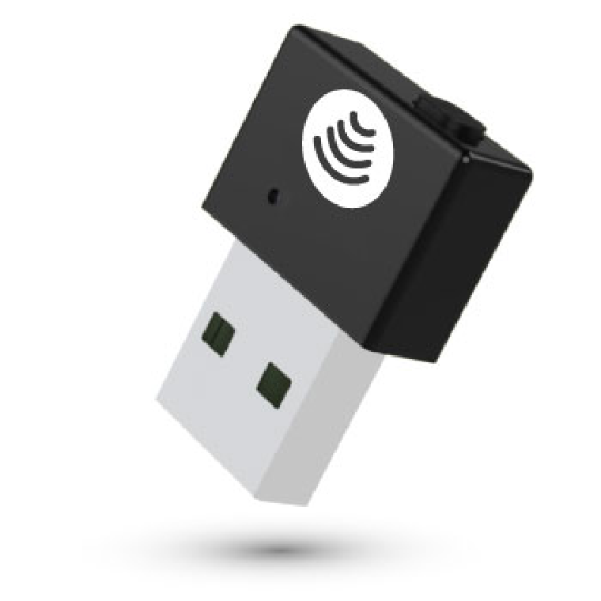

IDmelon Reader is a plug and play hardware, which enables users to have <b>Tap-n-Login</b> experience with their smartphones.

Workspaces with shared computers need to use IDmelon Readers.

<a role="button" class="btn btn-primary btn-lg d-block mb-3" href="https://www.idmelon.com/idmelon-reader/">Learn More</a>
<a role="button" class="btn btn-primary btn-lg d-block mb-3" href="https://www.idmelon.com/pricing/">Buy an IDmelon Reader</a>
<a id="back" role="button" class="btn btn-primary btn-lg d-block mb-3">Back</a>

